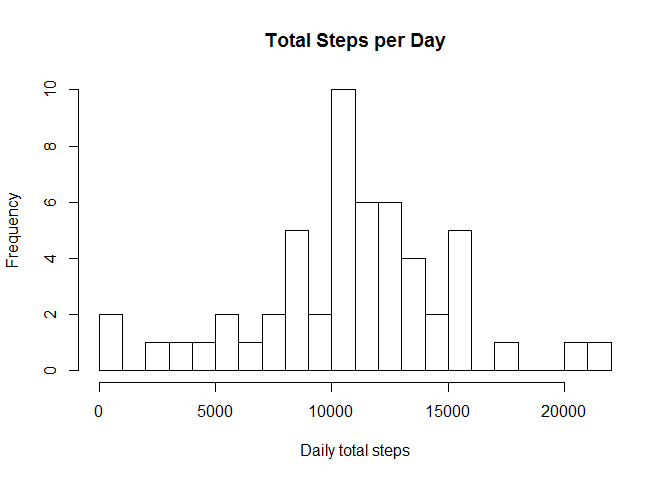

### Introduction

It is now possible to collect a large amount of data about personal
movement using activity monitoring devices such as a Fitbit, Nike
Fuelband, or Jawbone Up. These type of devices are part of the
“quantified self” movement – a group of enthusiasts who take
measurements about themselves regularly to improve their health, to find
patterns in their behavior, or because they are tech geeks. But these
data remain under-utilized both because the raw data are hard to obtain
and there is a lack of statistical methods and software for processing
and interpreting the data.

This assignment makes use of data from a personal activity monitoring
device. This device collects data at 5 minute intervals through out the
day. The data consists of two months of data from an anonymous
individual collected during the months of October and November, 2012 and
include the number of steps taken in 5 minute intervals each day.

Loading and preprocessing the data
----------------------------------

    activityData <- read.csv('activity.csv')
    head(activityData)

    ##   steps       date interval
    ## 1    NA 2012-10-01        0
    ## 2    NA 2012-10-01        5
    ## 3    NA 2012-10-01       10
    ## 4    NA 2012-10-01       15
    ## 5    NA 2012-10-01       20
    ## 6    NA 2012-10-01       25

What is mean total number of steps taken per day?
-------------------------------------------------

Make a histogram of the total number of steps taken each day

    sumStepsPerDay <- aggregate(steps ~ date, activityData, sum, na.rm = TRUE)
    hist(sumStepsPerDay$steps, breaks = 20, xlab = "Daily total steps", ylab = "Frequency", main = "Total Steps per Day")

Calculate the mean an median total number of steps taken per day

    rmean <- mean(sumStepsPerDay$steps)
    rmedian <- median(sumStepsPerDay$steps)
    cat("The mean steps per day: ", rmean)

    ## The mean steps per day:  10766.19

    cat("The median steps per day: ", rmedian)

    ## The median steps per day:  10765

What is the average daily activity pattern?
-------------------------------------------

Make the time series plot of the 5-minute interval and the average of
steps taken, averaged across all days

    stepsByInterval <- aggregate(steps ~ interval, activityData,mean,na.rm = TRUE)
    plot(stepsByInterval$interval,stepsByInterval$steps,type = "l", xlab = "Interval", ylab = "steps", main = "Average Number of Steps per Interval")

Which 5-minute interval, on average across all the days in the dataset,
contains the maximum number of steps?

    intervalMAXSteps <-stepsByInterval[which.max(stepsByInterval$steps),]$interval
    cat("The 5-minute interval, on average across all the days in the data set, containing the maximum number of steps is ",intervalMAXSteps)

    ## The 5-minute interval, on average across all the days in the data set, containing the maximum number of steps is  835

Imputing missing values
-----------------------

Total number of missing values in the dataset

    missingData = sum(is.na(activityData$steps))
    cat("Number of missing values: ", missingData)

    ## Number of missing values:  2304

Fill in all of the missing values in the dataset by using mean for that
day and make a histogram of the total number of steps taken each day

    activityDataNoNA <- activityData
    activityDataNoNA$steps[is.na(activityDataNoNA$steps)] <- mean(activityData$steps, na.rm = TRUE)
    totalStepsNoNA <- aggregate(steps ~ date, activityDataNoNA, sum)
    hist(totalStepsNoNA$steps, breaks = 20, xlab = "Frequecy", ylab = "Frequency", main = "Total Steps per Day with No NA")

Calculate the mean and median total number of steps taken per day with
no missing values

    rmeanNoNA <- mean(totalStepsNoNA$steps)
    rmedianNONA <- median(totalStepsNoNA$steps)
    cat("The mean steps per day with no missing values: ", rmeanNoNA)

    ## The mean steps per day with no missing values:  10766.19

    cat("The median steps per day with no missing values: ", rmedianNONA)

    ## The median steps per day with no missing values:  10766.19

Are there differences in activity patterns between weekdays and weekends?
-------------------------------------------------------------------------

    activityDataNoNA$date <- as.Date(strptime(activityDataNoNA$date, format="%Y-%m-%d"))
    Sys.setlocale("LC_TIME", "C")

    ## [1] "C"

    activityDataNoNA$weekDayType <- ifelse(weekdays(activityDataNoNA$date) %in% c("Saturday", "Sunday"), "Weekend", "Weekday")
    head(activityDataNoNA)

    ##     steps       date interval weekDayType
    ## 1 37.3826 2012-10-01        0     Weekday
    ## 2 37.3826 2012-10-01        5     Weekday
    ## 3 37.3826 2012-10-01       10     Weekday
    ## 4 37.3826 2012-10-01       15     Weekday
    ## 5 37.3826 2012-10-01       20     Weekday
    ## 6 37.3826 2012-10-01       25     Weekday

    plotData <- aggregate(steps ~ interval + weekDayType,  activityDataNoNA, mean)
    library(lattice)
    xyplot(steps ~ interval | weekDayType, data = plotData, layout= c(1,2), type = "l")

